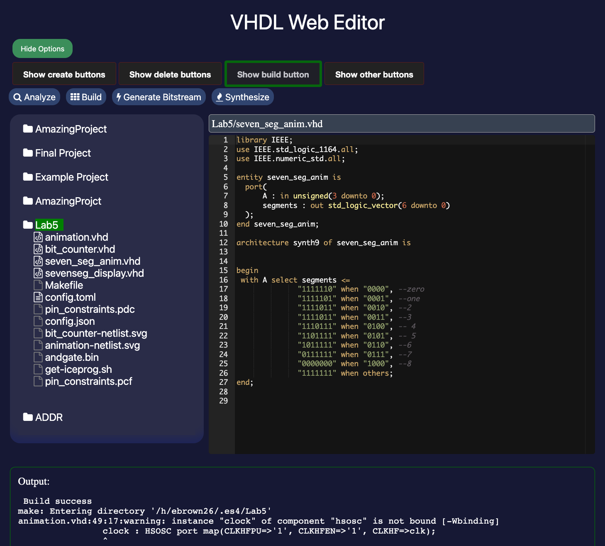
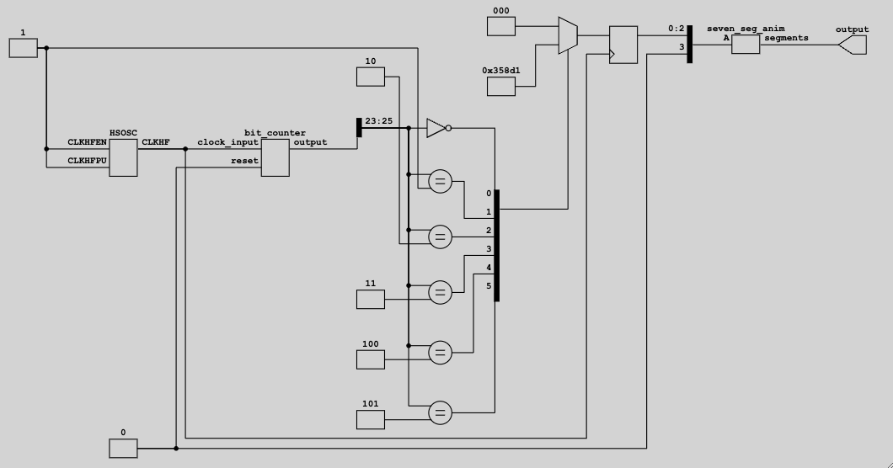

## Platform Agnostic Web IDE for ICE40 FPGAs
> Capstone Project, Tufts Universtiy, 2023
> Sponsor: Professor Steven Bell of the EECS department at Tufts University

## Table of contents
- [Project Description](#project-description)
- [Documentation](#documentation)
  - [Design Considerations](#design-considerations)
  - [Future enhancements](#future-enhancements)
- [Contributing](#contributing)
 

## Project Description
This project builds a platform-agnostic web ide for ICE40 FPGAs. Users will be able to build projects, compile their code to bitstreams, , and flash their bitstreams to their FPGA all from the comfort of their web browser and a GUI application. This project is built using [Flask](https://flask.palletsprojects.com/en/2.0.x/) for the backend, and vanilla html and javascript for the frontend. To begin, please see [Student User Documentation](docs/student-documentation.md) for more information on how to use this website.

> This is intended to be used in combination with ES4 and other related courses at Tufts University which use VHDL and ice40 FPGAs. This is written with assumptions about the enviornment in which it runs. See [Maintainer Documentation](docs/images/maintainer-documentation.md) for more information.

#

## Documentation
- [Student User Documentation](docs/student-documentation.md)
- [Maintainer Documentation](docs/maintainer-documentation.md)

### Design Considerations
- This project was built to circumvent using Lattice Radiant, which[ only is supported on Windows and Linux computers](https://www.latticesemi.com/LatticeRadiant?pr031521) at this time. Lattice Radiant is a featureful design suite for building and analyzing VHDL projects. This WebIDE excells at it's quick setup and ease of use. 

- If your project grows larger than what can easily be handled in this website enviornment, the code is fully exportable to a new enviornment using Download Folder button on the website. A machine created `Makefile` can be run using the `make` command from the command line to build the project, and will build the full project as needed. However, you will need to install the needed build tools (ghdl, yosys). The code for generating this Makefile can be found in [app.py](app.py)

- The backend uses a stateless request handling architecture, to help easily scale this project to appropriately handle load.

### Future enhancements
- It would be ideal to be able to flash code directly to the FPGA from the website. [Lots of endeavors were attempted to solve this problem](#docs/AttempsToFlashLessons), but we ended unsuccessfully. If one were able to solve this problem, it would be greatly appreciated.

- A fully atonomously hosted version of this project would be ideal. Currently, the project is hosted on the Tufts EECS servers, and is not intended to be used outside of that environment. A easy to setup and use version of this website for an individual user, or with user sessions would be great for the open source community.

## Contributing
Contributions are welcome, but this repository is infrequently checked. If you would like to contribute, please open an issue or pull request. See [Future Enhancements](#future-enhancements) for ideas on what to contribute.

> Note: This project mentions and depends on a Flasher GUI, which can be on github at [github.com/Ellis-Brown/iceprog](github.com/Ellis-Brown/iceprog).
