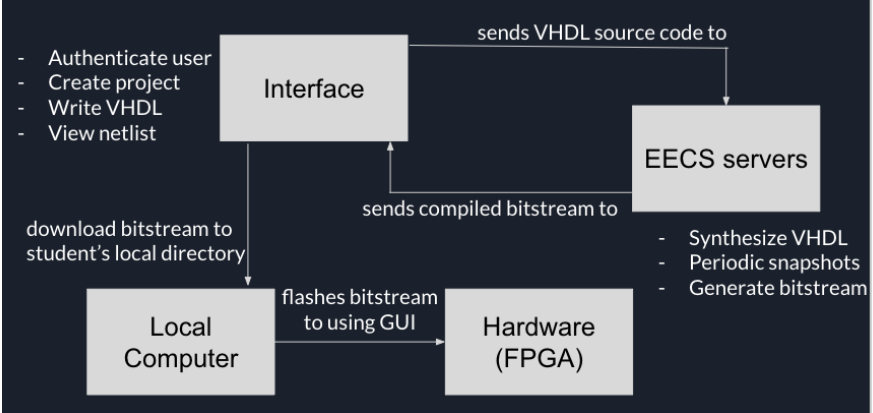

## Project Structure
This explains how the project is structured, and how it is intended to be used. This section is not intended to be a user guide for the project.

### Dependencies
This project is intended to be hosted on the Tufts University Electrical Engineering and Computer Science Department's servers. As such, it is currently run in production using following setup
- Backend enviornment: Red Hat Enterprise Linux
- Every user is expected to have a user account on the server
    - accounts are in the form `/h/USERNAME`
        - `/h/ebrown26` for example, where ebrown26 is the student UTLN.
- Every user has run the [installation script](bin/setup.sh) before using the web IDE

## Installation
This section is intended to be used by the Tufts University EECS admins, not by students. For students, please see [Usage](#Usage)

- Clone the repository
- Install the needed FPGA toolchains [TODO](#TODO)

### System Design

#### File Layout
- Frontend: HTML/CSS and Javascript. Found in [templates/index.html](templates/index.html) and [templates/layout.html](templates/layout.html).
- Backend: Flask server, found in [app.py](app.py)
    - Server is started by running `./run_server`, which can be found in [run_server](run_server). Make sure to make this script executable by first typing `chmod +x run_server`
- Database: None. The backend is the Tufts University EECS servers, which are used to store the user's files. If you were running this project outside of that enviornment, it is recommended you use a blobstore to store the user's files. See [Dependencies](#Dependencies) for more information on the EECS servers.

#### Request Handling
The frontend does `fetch()` requests to the backend for all resources, to save files, and open files. The backend processes these files directly on the file system, then serves them to the frontend. The frontend then renders the files as needed.

