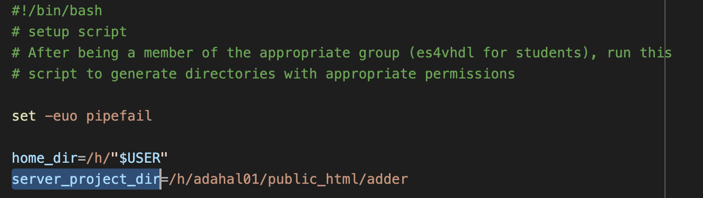
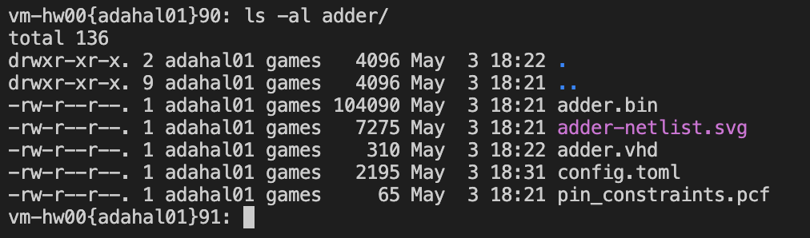

# Maintainer Documentation
This explains how the project is structured, and how it is intended to be used and maintained, from an admin perspective. This section is not intended to be a user guide for the project. 
> For students, please see [Student Documentation](student-documentation.md).

## Installation
- Clone the repository
- Follow [Web Application Setup](#web-application-setup)

### Web Application Setup
There are some steps to be taken in the beginning of the semester to set up the web application. These steps are explained in this section. Firstly, the repository where the web application resides is es4VHDL. Once you have this repository cloned in a directory on the Halligan servers, there are some steps you need to take in order to ensure every file that we need is present. Go to the bin/ directory and delete fpga-toolchain, as we will need a fresh version of the toolchain with all the binaries present. Go to this website to get the latest version of the toolchain: https://github.com/YosysHQ/fpga-toolchain/releases/tag/nightly-20211006. Copy the link for the nightly version of linux, and download it to es4vhdl/bin.

You can use the wget tool to download this from the command line. For example:

> vm-hw00{adahal01}139: wget "https://github.com/YosysHQ/fpga-toolchain/releases/download/nightly-20211006/fpga-toolchain-linux_x86_64-nightly-20211006.tar.xz"

Once the download is complete, the bin/ directory should look like this:

Now, we have to extract the toolchain. To do so, we can use tar:
> vm-hw00{adahal01}175: tar -xf fpga-toolchain-linux_x86_64-nightly-20211006.tar.xz

Wait for the directory to be extracted, and after it’s done, we can delete the tar.xz file. The bin/ directory should now look like this:

Great! This is all the set up we need to do for the web application.

### Student Account Setup (Groups and Passwords)
Students that are enrolled in the class must be a member of the es4vhdl unix group on the Halligan servers. Please contact Michael Bauer to add all the enrolled students to this group. Furthermore, all students must run a one-time script to set up all the necessary directories and permissions in the home directory on the Halligan servers. This is the setup.sh script which is present in the bin/ directory of  the repository. This sets up the directory for the web application per user, fixes permissions and imports a sample project.

Like in VHDLWeb, you need to generate passwords for each enrolled student in the class. The password hashes for each student is stored in a .htpasswd file in the root directory of the repository. For obvious security reasons, this file is not version controlled and it must only have rw permissions for the user (i.e., chmod 600 .htpasswd). The script to add passwords to this .htpasswd file is called add_user, and is located in the root directory of the repository.
- In the beginning of the semester, generate random passwords for each user enrolled in the class. It must be noted that the username must be their UTLN. To add the password hash to the aforementioned .htpasswd file, use the add_user script, supplying the username as the first command line argument. An example of adding a password for the user “test123” is shown below:
    - 
    - If you inspect the htpasswd file now, you should see an entry for the user “test123” like this: test123:$apr1$5cy/Fl4o$sRZgwg9pXhIqv29gd4d1t/
    - Repeat this for all students enrolled in the class
Once this is done, you can send the students their credentials and instructions to run the setup.sh script once (but only after you have read the section on setting up a sample project). Once that is done, they should be able to use the website once the server is up and running!

### How to run the server + view logs
To run the server, go to the root directory where the repository is located and simply execute the run_server script. All logs are automatically piped to the err.log file in the same directory. The logs are prepended by the username of the student, the timestamp, and the log level (INFO, ERROR, or WARNING). The web app runs using gunicorn on port 8080 by default, but this can be changed in the run_server script.

### How to view snapshots
On every build, a “snapshot” of the student’s current project is taken by the web application and copied to a hidden directory in the root directory of the repository. This directory is called .backup/. It stores timestamped project directories for all students. An example structure of a .backup directory is shown below:

Individual student project backups look like this:

## Sample Project Documentation 
where this folder should sit
- After running the setup.sh script, each student will have a sample project that will go through the files needed to get started with the web application (config, pin constraints, etc.). If you inspect the setup.sh script, there is a variable with a path to this sample project:

- When you cloned the repository, the sample project should also be present in the starterproject/adder directory. Please move the adder directory to your public_html directory on the Halligan servers, with permissions as shown below:

- Once this is done, go to setup.sh and change the server_project_dir to point to the adder directory in your public_html folder. That should do it for setting up the sample project! Finally, the setup.sh script can be run by the students to set up their environment.

### Dependencies
This project is intended to be hosted on the Tufts University Electrical Engineering and Computer Science Department's servers. As such, it is currently run in production using following setup
- Backend enviornment: Red Hat Enterprise Linux
- Every user is expected to have a user account on the server
    - accounts are in the form `/h/USERNAME`
        - `/h/ebrown26` for example, where ebrown26 is the student UTLN.
- Every user has run the [installation script](bin/setup.sh) before using the web IDE

### System Design

#### File Layout
- Frontend: HTML/CSS and Javascript. Found in [templates/index.html](templates/index.html) and [templates/layout.html](templates/layout.html).
- Backend: Flask server, found in [app.py](app.py)
    - Server is started by running `./run_server`, which can be found in [run_server](run_server). Make sure to make this script executable by first typing `chmod +x run_server`
- Database: None. The backend is the Tufts University EECS servers, which are used to store the user's files. If you were running this project outside of that enviornment, it is recommended you use a blobstore to store the user's files. See [Dependencies](#Dependencies) for more information on the EECS servers.

#### Request Handling
The frontend does `fetch()` requests to the backend for all resources, to save files, and open files. The backend processes these files directly on the file system, then serves them to the frontend. The frontend then renders the files as needed.

## Where to Debug
Where to debug code (explanation of each of our files)
The following file paths are in reference to the code found in https://github.com/dahalankur/es4VHDL. 
### Backend Application Code
You can configure how all frontend requests are handled, such as saving a file, building a project, and generating the Makefile.

[app.py](../app.py)
- This is where changes should be made to the server side code, as necessary
holds all backend routes
- Basic workflow in this file looks like this
    - Receive request from frontend to a particular route -> process the request given the user and their request -> send a JSON object indicating success/failure and other info back to the frontend -> the frontend then renders the changes

[run_server](../run_server)
- Begins the backend server. 
- This should run every time the machine starts up, and should happen on reboot. The system admin should configure this to be a process that begins on launch

`.htpasswd` and [add_user](../bin/add_user)
- The password hashes for each student is stored in a .htpasswd file in the root directory of the repository. For obvious security reasons, this file is not version controlled and it must only have rw permissions for the user (i.e., chmod 600 .htpasswd).
- In the beginning of the semester, generate random passwords for each user enrolled in the class. It must be noted that the username must be their UTLN. To add the password hash to the aforementioned .htpasswd file, use the add_user script, supplying the username as the first command line argument. An example of adding a password for the user “test123” is shown below:

> Note: `.htpasswd` is in the `.gitignore` file, so it will not be pushed to the repository. An example of user "ebrown26" with password "hi" hashed is shown below:
If you inspect the htpasswd file now, you should see an entry for the user `test123` like this: `test123:$apr1$5cy/Fl4o$sRZgwg9pXhIqv29gd4d1t/`
Repeat this for all students enrolled in the class

[build_files.py](../build_files.py)
- Exports the safe_run function to run code on the unix machine

[setup.sh](../bin/setup.sh)
- This is the main script that each student has to run at the beginning of the semester. In short, this sets up the directory for the web application per user, fixes permissions and imports a sample project. It has to be ensured that each student is a member of the es4vhdl unix group on the Halligan servers before running this script.

[Synthesize.sh](../bin/synthesize.sh)
- Given the path for a VHDL source file, this script generates a netlist in the svg format for the corresponding design. You should not need to ever run this script individually, for the backend will run it when receiving requests to synthesize a file.

### Frontend Application Code
[static/style.css](../static/style.css)
- Holds all styles for the text editor website

[templates/layout.html](../templates/layout.html) 
- Holds the header metadata, and the general content (index.html) rendering. This file, for the most part, can be ignored.

[templates/index.html](../templates/index.html)
- This is where changes should be made, as necessary, to client side code.
- Contains all client side code for the text editor. 
- Pre-builds the student’s file tree using server-side rendering and Jinja2 syntax
- All updates rebuild the file tree by parsing a returned JSON object
- Uses AceEditor to actually edit files. More information on Ace Editor can be found on their documentation page.
- The main code comes from the onClick events of the buttons, and the onClick events of the files in the file tree. All file tree objects will have the class name caret, and can be clicked on. Their onClick events will load the file, or show the dropdown of their sub-trees if they are folders
    - Nested folders are not tested or intended to be supported

### Flasher GUI application Code 
All flasher code and pre-built binaries can be found at [https://github.com/Ellis-Brown/iceprog](https://github.com/Ellis-Brown/iceprog).
The GUI works by bundling iceprog with a simple GUI wrapper. 
- We used PyInstaller to build the GUI natively on every platform. The command used to run the installation process was `pyinstaller --onefile --icon "vhdl-icon.ico" -w --add-binary "iceprog.exe:." run-gui.py`
- This assumes you have the app icon in a file called “vhdl-icon.ico” and the iceprog binary in a file called "iceprog.exe"”". This iceprog binary must work on the platform where this command is run to build the GUI tool.
- The source code for the flasher can be found in [run-gui.py](https://github.com/Ellis-Brown/iceprog/blob/main/run-gui.py)
> Note: There is also a command line script to help students install the iceprog binaries locally, then run from the command line without the GUI tool. It is not officially supported. However, this accounts for the other files in the repository, and it is recommended that these files are not deleted. 

> Note: The flasher GUI does not successfully stream data live from iceprog to the GUI, and will only show your output after flashing is fully complete or fails. A fix was attempted, but it was deemed not worthy of solving at this time.

