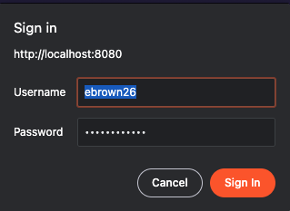
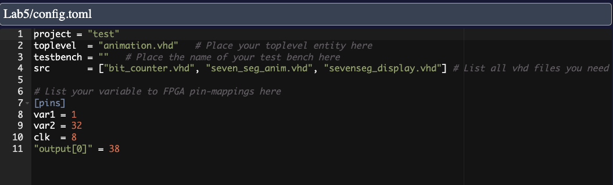
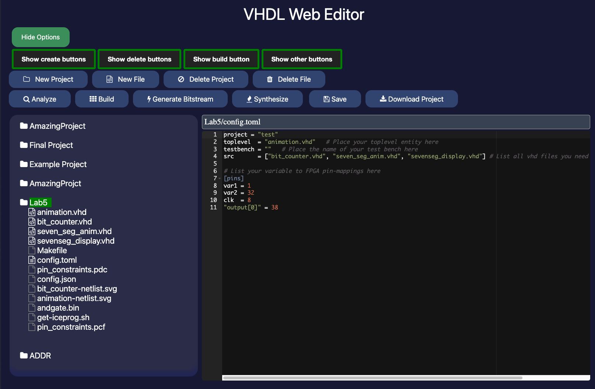

# Student Documentation
This explains the project from the perspective of a student in ES4 on how to use the Web IDE.

## Table of contents
  - [Usage](#usage)
  - [Buttons](#buttons)
    - [Create Buttons](#create-buttons)
    - [Build Buttons](#build-buttons)
    - [Other Buttons](#other-buttons)
- [Explanation of Sample Project](#explanation-of-sample-project)
    - [adder.vhd](#addervhd)
    - [config.toml](#configtoml)
    - [adder-netlist.svg](#adder-netlistsvg)
    - [pin_constraints.pcf](#pin_constraintspcf)
    - [adder.bin](#adderbin)
- [How to Flash Projects to FPGA from Website](#how-to-flash-projects-to-fpga-from-website)

## Usage
This section is intended to explain how a project would be used, from the perspective of a student in ES4. This section is not intended to be a technical overview of the project, but rather a user guide for the project.

> Requirement: The first time you use the project, make sure to run the installation script on your EECS account (ssh <utln>@homework.cs.tufts.edu). Please run the following command in your home directory on terminal: `wget https://raw.githubusercontent.com/dahalankur/es4VHDL/main/bin/setup.sh && chmod +x setup.sh && ./setup.sh`

1. Login to the website using your UTLN and __special password provided by the professor__. This is NOT your typical EECS password. If you do not have this password, please contact your professor.
    > 
2. Create a new project. Use the toggle button "Create Buttons" to show you these options.
3. Once you have created a new project, it will appear on the left side of your screen in the file tree with a config.toml file
  3.1 The config.toml file is used to declare the toplevel module, list the source code files, and declare the pin mappings  
4. You can click on the project name in the file tree to open the project in the IDE
5. Add or delete source code files as needed for your project
  5.1 As files are added to the project, they should be listed under the “src” part of the config.toml file
    > 
6. Analyze files to check for syntactic errors 
7. Synthesize individual files to check the netlist 
8. Build your project to generate the Makefile and pin constraints
  8.1 The config.toml file should be completely filled out by this point
9. Once the project has been built and you are ready to flash the code to your FPGA, generate the bitstream for the project
10. Download the bitstream to your computer 
11. Use the FlashToFPGA GUI application to flash the bitstream to your FPGA. This application is [available here](https://github.com/Ellis-Brown/iceprog), and can be downloaded and run on your computer. This application is available for Windows, Mac, and Linux. 

    > FlashToFPGA Icon for application  
    > 

### Buttons

The website has many features, so we are going to break them down more clearly by explaining what each button does. 

Show/Hide Options will display or hide 4 buttons: “Show Create Buttons”, “Show Delete Buttons”, “Show Build Buttons”, “Show Other Buttons”. Clicking on those 4 choices will lead to the buttons described below. 
 
#### Create Buttons
- New Project: To create a new project, click this button and enter your project name. If this project name already exists, a new project will not be created. Upon creation of a new project, there will already be a config.toml file in your project with the project name filled in. The new project will be displayed on the left side of the screen under the file tree.
- New File: To create a new file, click on the project in the file tree on the left side of the screen where you want the file to reside. Once you have clicked on the project name, click this button and enter your file name. If the file is a VHDL source file, its extension should be “.vhd”. Once you have created a new file it will be displayed in the file tree underneath the project and you can click on its name to open the file and start writing code.
#### Delete Buttons
- Delete Project: If you want to delete a project, click on the project name in the file tree and then click this button. Deleting a project completely removes it and you will not be able to recover it. 
- Delete File: If you want to delete a file, click on the file name in the file tree and then click this button. Deleting a file completely removes it and you will not be able to recover it. 
#### Build Buttons
- Analyze: If you want to analyze a file to check it for syntactic errors, you can click on this button. The output of the analysis will display in a box at the bottom of the screen. 
- Build: If you want to build a project, you can click on this button. It will generate a Makefile and pin constraints for the project based on the config.toml file. “make” will then be run on the source code and the output will be displayed in the box at the bottom of the screen. Build will also regenerate a netlist of the toplevel file each time it is run.
- Generate Bitstream: To create a .bin file for your project that can be flashed to the FPGA, click on this button. The .bin file will be saved under the project and if you click on the file in the file tree a “Download .bin” file button will appear on screen. This will download the bitstream so that you can flash it to the FPGA using the application described in the documentation.
- Synthesize: To create a netlist of a specific source code file, click on this button. A corresponding netlist file titled “filename-netlist.svg” will be generated and appear in the file tree. When this file is opened, you can view the netlist on the website. 

#### Other Buttons
- Save: If you want to save your file, you can either click on this button or use the Ctrl+S. There will be a save indicator next to the filename in the bar above the file output so that you can easily see if your project has been edited. If you have unsaved changes on your opened file and try to switch to another file there will be a prompt asking if you’d like to swap files. If you say yes, your changes will not be saved. If you say no, you have the chance to save your file before swapping. 
- Download Project: If you would like to download a project in order to have a copy locally on your computer, you can click on this button. A zip file titled with the project name will be downloaded onto your computer.

### Explanation of Sample Project
When you login to the website for the first time, you’ll notice there is a project already showing in your file tree. This is a sample project that will help you understand how to work with the website. Descriptions of each of the files are provided for you to reference as you begin working on your first ES4 projects. 

The overall project is titled adder and it contains the logic for the addition of three one-bit binary numbers. If you want to download a copy of this project and store it locally on your computer, you can click on the “Download Project” button (downloaded as “adder.zip”).

#### adder.vhd
- This file contains the source code for the adder project. There are 5 variables defined in the code (A, B, Cin, S, Cout). A, B, and Cin are the one-bit binary numbers being added together. S is the sum output and Cout is the carry bit. The code also defines all of the logic for the adder. 
If you analyze this file, there should be no errors.
#### config.toml
- This file contains the definition of the toplevel file and the source files. For this project the toplevel is “adder.vhd” and there is only one source file, which is also “adder.vhd”. If there were more source files, they would be placed in quotes within the src list separated by commas.
- The config file also contains the mappings of variables to FPGA pins. In this case, we had 5 variables that needed pin assignments. They can be defined by saying, “A = 26”. 
- When the project is built, if there are any problems with the config file, they will be displayed in the output box at the bottom of the screen.
####  adder-netlist.svg
- This file contains the corresponding netlist for the adder. When you open the file you can see the logic gates/hardware components/connections that are required to build the adder. This file can be generated by clicking on “adder.vhd” then clicking on the “synthesize” button or by clicking on the folder “adder” then clicking on the “build” button. 
####  pin_constraints.pcf
- You do not need to edit this file directly.
- This file is generated when you click on the build button. It contains the pin constraints based on the mappings defined in the config file. It will be regenerated every time you click on the build button 
####  adder.bin
- This file is generated when you click on the “Generate Bitstream” button. It is the binary file that contains the configuration information for the FPGA. 
You’ll notice that a download button appears on the screen when you click on this file. In order to flash the file to the FPGA, you must download “adder.bin” and then use the FPGA Flash Application that is described in the documentation.

### How to Flash Projects to FPGA from Website
To flash a project to your FPGA, you will need an FPGA, a wire to connect the FPGA to your computer, and a project that has been completely built. Please see how to build a project and assign pins in the workflow section of this documentation.

1. Build your project. Assign your pin configurations in `config.toml` in your project’s directory
2. Download the .bin file associated with your project. It should appear in the downloads folder of your computer.
3. Open up the FlashToFPGA application. 
    - On Windows, this will be in a folder based on where you installed it. See the [How to install FPGA flash](#https://github.com/Ellis-Brown/iceprog) documentation on the github page
    - On Mac, this should be in your applications folder on your computer. You should also be able to find this using Spotlight Search, by pressing Command + Space, then searching “FlashToFPGA.app”
    - On Ubuntu and other Linux platforms, this will be in a folder based on where you installed it. See the [How to install FPGA flash](#https://github.com/Ellis-Brown/iceprog) documentation on the github page
4. Select your downloaded bin file
5. Press the flash button
    - On both failure and success, make sure to read the log output in the flashing GUI screen
6. To update the FPGA, make a change on the website, rebuild the project, download the file, and select it before you attempt to flash again. Changes made on the website will not be reflected until you re-download the file.

